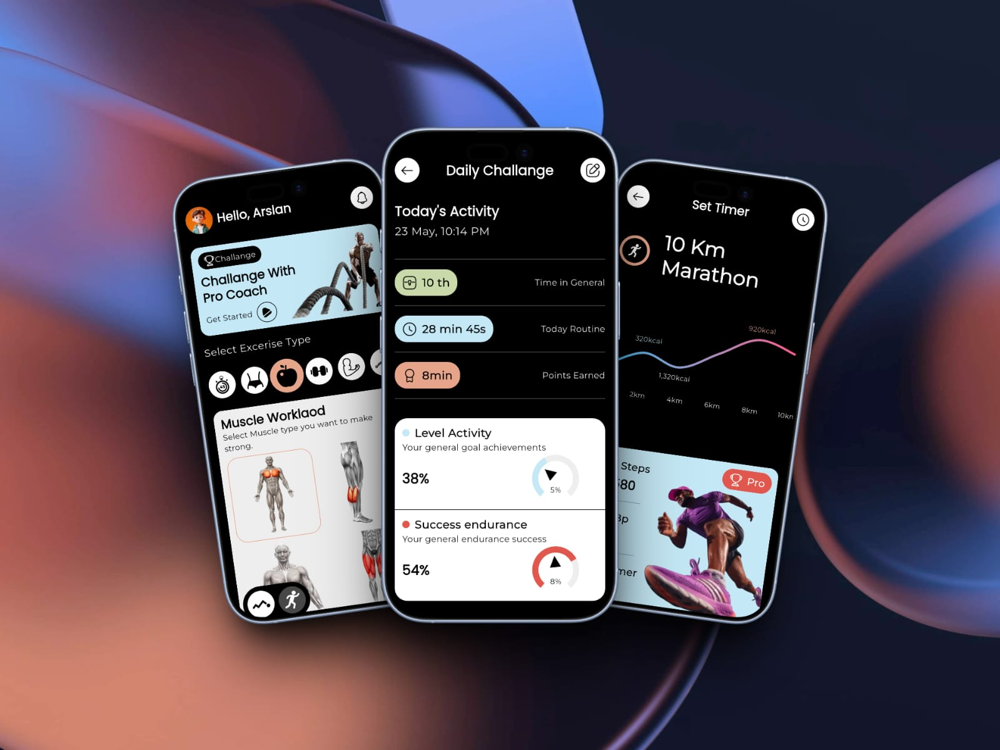

# AetherFit 💪🔥

A fitness tracking UI app built with Flutter — clean dashboard design with gauges, charts, and a dark athletic aesthetic.


## 📸 UI



---

## ✨ Features

- 🏃 **Activity Rings & Gauges** — Syncfusion circular gauges for steps, calories, and active minutes
- 📊 **Weekly Progress Charts** — fl_chart bar/line charts for workout history
- 🧭 **Clean Navigation** — GoRouter with structured routing
- 🎨 **SVG Assets** — Crisp vector icons at any screen size
- 📐 **Centralized Constants** — AppSizes, AppColors, AppTextStyles in dedicated files
- 🔤 **Custom Fonts** — Montserrat + Poppins for a modern fitness-app feel
- 📱 **Responsive Layout** — Adapts across screen sizes

---

## 🛠️ Tech Stack

| Package                             | Purpose                          |
| ----------------------------------- | -------------------------------- |
| `go_router ^17.2.3`                 | Navigation & routing             |
| `syncfusion_flutter_gauges ^33.2.7` | Activity rings & progress gauges |
| `fl_chart ^1.2.0`                   | Workout stats charts             |
| `flutter_svg ^2.3.0`                | SVG icon rendering               |
| `iconsax ^0.0.8`                    | Modern icon set                  |
| `gap ^3.0.1`                        | Clean spacing                    |

---

## 🏗️ Project Structure
lib/
├── core/
│   ├── const/                    # All spacing, sizing constants
│   │   └── app_sizes.dart
│   ├── extensions/               # BuildContext extensions
│   │   └── app_extensions.dart
│   └── theme/                    # Theme & styling
│       └── app_theme.dart
├── data/
│   └── routes/
│       └── app_routes.dart       # GoRouter configuration
├── features/
│   ├── pages/                    # Screen/Page widgets
│   │   ├── homepage.dart
│   │   ├── activity_page.dart
│   │   └── marathon_page.dart
│   └── widgets/                  # Feature-specific components
│       ├── app_header_navbar.dart
│       ├── homepage_category.dart
│       ├── homepage_footer.dart
│       ├── homepage_main_section.dart
│       ├── activity_indicator.dart
│       ├── activity_page_card.dart
│       ├── marathon_card.dart
│       └── marathon_footer_card.dart
└── main.dart

## 🚀 Getting Started

```bash
git clone https://github.com/dartrox404/AetherFit.git
cd AetherFit
flutter pub get
flutter run
```

---

## 🗺️ Roadmap

UI-only at this stage. Planned next steps:

- [ ] Connect real step count via `health` package
- [ ] Firebase backend for workout logging
- [ ] User auth + personal progress history
- [ ] Push notifications for workout reminders

---

## 👨‍💻 Author

Arslan Javed — Flutter Developer
📧 Email: arslanjaved57420@gmail.com
🔗 GitHub: @dartrox404
💼 LinkedIn: arslan-javed-060aaa35b

## 📄 License

This project is open source and free to use for personal & educational purposes.

## 🤝 Contributing

This is a personal learning project. Feedback & suggestions are welcome — open an issue or reach out directly.

## ⚠️ Disclaimer

UI-only prototype. All activity data shown is demo/hardcoded. Not for production health tracking. The app is built for learning Flutter UI/UX patterns.

Last Updated: May 2026
Status: Active Development — Phase 1 (UI) Complete, Phase 2 (State Mgmt) In Progress
